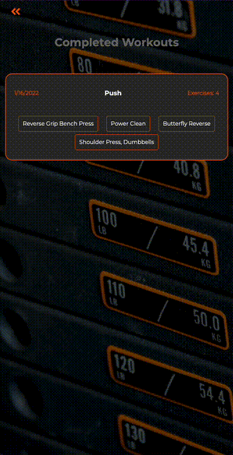

# PPL App

## [Try it out here.](https://mpowers1113.github.io/ppl-app "PPL App")

An application for weight lifters who want to optimize their workout and add variation to their Push/Pull/Legs (PPL) split.

## Technologies Used

- JavaScript
- Ajax
- HTML 5
- CSS 3

## What is "Push Pull Legs"?

Push Pull Legs (PPL) is the most common and arguably most efficient workout split that divides workouts by their primary movement.

#### Push:

- Shoulders
- Chest
- Triceps

#### Pull:

- Back
- Biceps

#### Legs:

- Glutes
- Quads
- Hamstrings

#### Target Demographics:

- Weightlifters
- gym-goers
- fitness-enthusiasts.

## Why PPL App?

I love sharing my passion for bodybuilding with friends and family, and I'm often asked to design someone a workout.

The truth is, the most important part of designing a workout plan is ensuring each exercise has a purpose - and the PPL split addresses this perfectly.

Each exercise should target the muscle group in a different way than the previous, and each workout should stimulate the various parts of that muscle group.

**_And here's the other thing..._**

People get bored doing the same workout over and over.

That's why randomizing the workouts was an important feature. The user can add, remove, switch, and randomize until they find a workout they want to do - because what really matters is that they workout period.

## Generating a Workout:

## Viewing Completed Workouts:

### Features:

1. User can generate a workout by Push, Pull, or Legs focus.

2. User can search exercises by tag, ie “Glutes”.

3. User can randomly generate a new exercise by double-clicking/tapping current exercise.

4. User can add an exercise by clicking a "plus" icon.

5. User can to expand each exercise to show a description of the movement.

6. User can remove an exercise by clicking a "minus" icon.

7. User can click a "check-mark" icon to mark an exercise complete.

8. User can view completed workout in a separete tab.

## Stretch Features

1. **User can click on a saved workout to redo that workout:**

   It's not uncommon to find a great workout that you want to do again and again. By adding a log in to keep track of the user, they could find their completed workouts and do them as many times as they'd like.

2. **User can view videos of exercise demonstrations:**

   There are limitations when using a public API. The API I've used for PPL App has a limited amount of photos for each exercise, and no videos of the exercise being performed.

   The simplest way to add video demonstrations would be embedding a YouTube link that queries the exercise by name.

### Getting Started

Clone the repository.

`git clone git@github.com:mpowers1113/ppl-app.git `

`cd eggDropFinal`

right-click `index.html` and open with your current live-server extension.
=======

An application for weight lifters who want to optimize their workout and add variation to their Push/Pull/Legs (PPL) split. The PPL split is the most common and arguably most efficient workout split that divides workouts by their primary movement. 

### -Push: Shoulders, Chest, Triceps
### -Pull: Back, Biceps
### -Legs: Glutes, Quads, Hamstrings

### Target Demographics: Weightlifters, gym-goers, fitness-enthusiasts. 

### Features: 

1. User can generate a workout by Push, Pull, or Legs focus. 

If a user wants to perform a Push, Pull, or Legs workout, they should be able to generate a workout by that selection.

2. User can search exercises by tag, ie “Glutes”.

If a user prefers to find an exercise by a more specific target muscle group than the broader PPL categories, they should be able to click a tag button to find relevant exercises. 

3. User can search exercises by target muscle group, ie “Biceps”. 

If a user prefers to find an exercise by a specific muscle group rather than the more broad PPL categories, they should be able to search that muscle group to find relevant exercises. 

4. User can randomly generate a new exercise by double-clicking/tapping current exercise.

If a user does not want to do the generated exercise, they should be able to generate a new exercise for that muscle group by clicking/tapping the exercise. 

5. User can generate workout by total number of exercises, between 5 - 8 exercises. More than this is considered too much volume by professionals. 

If a user wants to do more than 5 exercises, they should be able to select the number of exercises generated. 

6. User can to expand each exercise, showing description and picture.

If a user has completed an exercise, they should be able to remove it from the list to see what exercises they have left. 

7. User can click “mark complete” to remove an exercise from their list.

If a user has completed an exercise, they should be able to remove it from the list to see what exercises they have left. 

8. User can mark each exercise complete and view completed exercise. 

Once the user has completed their workout, they can view the exercises they've done in a separate tab. 

